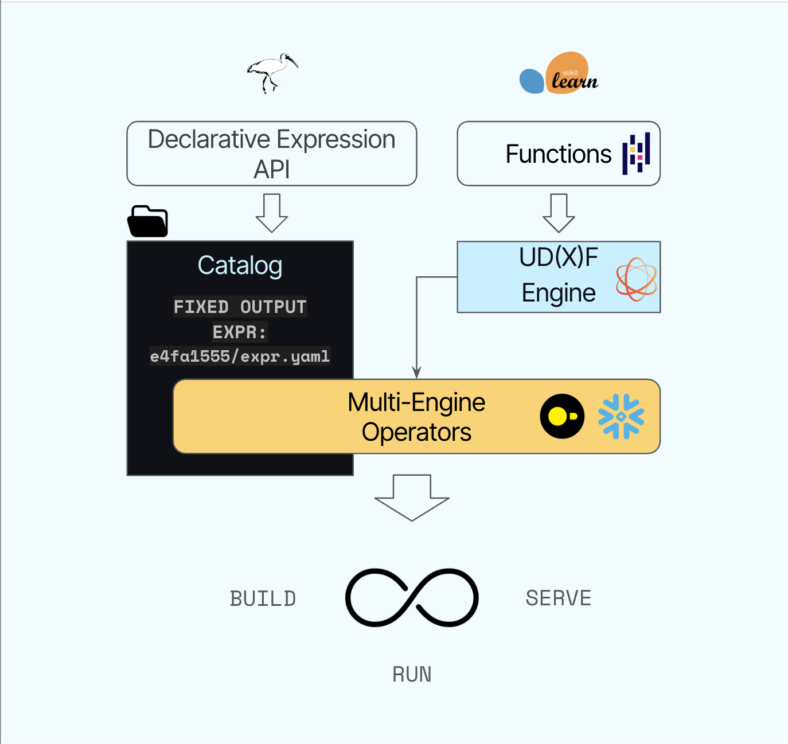

<div align="center">


</div>

> **✨ Xorq is an opinionated framework for cataloging composable compute
> expressions for your data in flight. ✨**

Popular Python tools like pandas and Ibis make data exploration enjoyable—but
when it's time to build reliable ML pipelines across multiple engines, things
quickly become complex.

As data scientists, we found that building ML pipelines, especially multi-stage
and multi-source pipelines, is frustrating work. SQL-pandas impedance
mismatches. Wasteful recomputation time and costs. Pipelines that work
perfectly in notebooks, but take forever to re-engineer for deployment--and
then deliver different results or fail in production. We built Xorq to
eliminate these problems - a library with a simple declarative syntax for
defining ML pipelines as portable, reusable components that can be cataloged
and governed like code.

[More on why we built Xorq](#why-xorq).

Xorq lets you:

* **Write expressive, pandas-style transformations** without memory constraints.
* **Move between SQL engines and Python** within a single declarative pipeline.
* **Build portable UDFs** that run consistently across engines and effortlessly composed.
* **Serve cached intermediate results**, so no computation is wasted.
* **Save diff-able YAML artifacts** for reproducibility and CI/CD.
* **Get compile-time validation** through declarative expressions.

## Demo Time!

Let's see Xorq in action.

[TBD: This section will be updated with a video demo soon!]

## Getting Started with Xorq

###  Installation and Requirements

```bash
pip install xorq  # or pip install "xorq[examples]"
```
* Python 3.9+
* Apache Arrow 19.0+

### 1. Load and Prepare Data

```python
import xorq as xo
from xorq.expr.ml.pipeline_lib import Step
from sklearn.neighbors import KNeighborsClassifier

# Fetch penguins dataset from pandas backend
pandas_con = xo.pandas.connect()
expr = xo.examples.penguins.fetch(backend=pandas_con)

# Filter out rows with missing values
expr = expr.filter(
    expr.bill_length_mm.isnull() == False,
    expr.bill_depth_mm.isnull() == False,
    expr.flipper_length_mm.isnull() == False,
    expr.body_mass_g.isnull() == False,
)
print(expr.schema())
print(expr.ls.backends)
```
> ```sh
> Out[2]:
> ibis.Schema {
>   species            string
>   island             string
>   bill_length_mm     float64
>   bill_depth_mm      float64
>   flipper_length_mm  int64
>   body_mass_g        int64
>   sex                string
>   year               int64
> }
> Out[3]:
> (<xorq.backends.pandas.Backend at 0x107767f70>,) #<-- just a pandas backend
> ```

### 2. Define Features and Move to Xorq Backend

```python
features = ['bill_length_mm', 'bill_depth_mm', 'flipper_length_mm', 'body_mass_g']
target = 'species'

# Move to Xorq's embedded backend for deferred execution
# Xorq ships with a modified DataFusion based engine that is especially
# designed for Arrow UDF and UDAF execution.
con = xo.connect()
expr = expr.into_backend(con)
print(expr.ls.backends)
```
> ```sh
> (<xorq.backends.pandas.Backend object at 0x107767f70>, <xorq.backends.let.Backend object at 0x17fcbeb00>)
> ```

### 3. Build and Fit ML Pipeline

```python
# Create a KNN classifier step
step = Step(KNeighborsClassifier)

# Fit the model - this creates a deferred pipeline
fitted = step.fit(expr, features=features, target=target)
print(fitted)
```

This creates a `FittedStep` object that contains both the trained model and the computational graph needed to reproduce predictions.

> **Output:**
> ```
> FittedStep(step=Step(typ=<class 'sklearn.neighbors._classification.KNeighborsClassifier'>,
> name='kneighborsclassifier_5353694976', params_tuple=()),
> expr=r0 := Read[name=penguins, method_name=read_csv, source=pandas-4354090912]
>   species           string
>   island            string
>   bill_length_mm    float64
>   bill_depth_mm     float64
>   flipper_length_mm int64
>   body_mass_g       int64
>   sex               string
>   year              int64
>
> r1 := Filter[r0]
>   IsNull(r0.bill_length_mm) == False
>   IsNull(r0.bill_depth_mm) == False
>   IsNull(r0.flipper_length_mm) == False
>   IsNull(r0.body_mass_g) == False
>
> RemoteTable[r1, name=ibis_rbr-placeholder_pz63nqkmljeujh]
>   features=('bill_length_mm', 'bill_depth_mm', 'flipper_length_mm', 'body_mass_g'),
>   target='species', storage=None, dest_col=None)
> ```

> Aside:
> What does deferred execution mean? Deferred execution means that the actual
> computation is not executed immediately. Instead, it builds a computational
> graph that can be executed later, allowing for optimizations and better
> resource management.

### 5. Make Predictions with Deferred Execution

```python
# Create a new expression that includes predictions
y_expr = expr.mutate(
    predicted=fitted.deferred_predict.on_expr  # Features and target are automatically inferred
)

# Execute only when needed
y_pred = y_expr.predicted.execute()
y_actual = expr[target].execute()

# Calculate accuracy
accuracy = (y_actual == y_pred).mean()
print(f'Deferred pipeline accuracy: {accuracy:.2%}')
```

> **Output:**
> ```
> Deferred pipeline accuracy: 97%
> ```

Save this as file as `expr.py`.
### 4. Build and Deploy the Pipeline

Once you have your fitted pipeline, you can build and deploy it using Xorq's CLI:

```bash
# Build the pipeline for deployment
xorq build expr.py -e y_expr
```

> **Build Output:**
> ```
> Building y_expr from scripts/expr.py
> Written 'y_expr' to builds/ca3da8b86a86
> builds/ca3da8b86a86
> ```

Now you can run the built pipeline:

```bash
xorq run builds/ca3da8b86a86
```
> **Run Output:**
>
> ```
> ❯ lt builds/ca3da8b86a86
> .
> ├── 8b5f90115b97.sql
> ├── 8d14b1afefa2.sql
> ├── 984aa14b8fde.sql
> ├── 6130850ff0a4.sql
> ├── deferred_reads.yaml
> ├── expr.yaml
> ├── metadata.json
> ├── profiles.yaml
> └── sql.yaml
> ```
Notice that we have an expr.yaml file with complete schemas and lineage
information as well as debug outputs for SQL. The expr can rountrip back and
forth from Ibis expressions.

>```yaml
>❯ cat deferred_reads.yaml
>reads:
>  penguins-36877e5b81573dffe4e988965ce3950b:
>    engine: pandas
>    profile_name: 08f39a9ca2742d208a09d0ee9c7756c0_1
>    relations:
>    - penguins-36877e5b81573dffe4e988965ce3950b
>    options:
>      method_name: read_csv
>      name: penguins
>      read_kwargs:
>      - source: /Users/hussainsultan/Library/Caches/pins-py/gs_d3037fb8920d01eb3b262ab08d52335c89ba62aa41299e5236f01807aa8b726d/penguins/20250206T212843Z-8f28a/penguins.csv
>      - table_name: penguins
>    sql_file: 8b5f90115b97.sql
>
>```
and similarly expr.yaml (just a snippet):

> ```yaml
> predicted:
>   op: ExprScalarUDF
>   class_name: _predicted_e1d43fe620d0175d76276
>   kwargs:
>     op: dict
>     bill_length_mm:
>       node_ref: ecb7ceed7bab79d4e96ed0ce037f4dbd
>     bill_depth_mm:
>       node_ref: 26ca5f78d58daed6adf20dd2eba92d41
>     flipper_length_mm:
>       node_ref: 916dc998f8de70812099b2191256f4c1
>     body_mass_g:
>       node_ref: e094d235b0c1b297da5c194a5c4c331f
>   meta:
>     op: dict
>     dtype:
>       op: DataType
>       type: String
>       nullable:
>         op: bool
>         value: true
>     __input_type__:
>       op: InputType
>       name: PYARROW
>     __config__:
>       op: dict
>       computed_kwargs_expr:
>         op: AggUDF
>         class_name: _fit_predicted_e1d43fe620d0175d7
>         kwargs:
>           op: dict
>           bill_length_mm:
>             node_ref: ecb7ceed7bab79d4e96ed0ce037f4dbd
>           bill_depth_mm:
>             node_ref: 26ca5f78d58daed6adf20dd2eba92d41
>           flipper_length_mm:
>             node_ref: 916dc998f8de70812099b2191256f4c1
>           body_mass_g:
>             node_ref: e094d235b0c1b297da5c194a5c4c331f
>           species:
>             node_ref: a9fa43a2d8772c7eca4a7e2067107bfc
> ```

Please note that this is still in beta and the spec is subject to change.


### 6. Explore Pipeline Lineage

One of Xorq's most powerful features is its ability to track the complete lineage of your computations:

```python
from xorq.common.utils.lineage_utils import build_column_trees, print_tree

# Visualize the computational graph for predictions
print_tree(build_column_trees(y_expr)['predicted'])
```

> **Lineage Tree Output:**
> ```
> ExprScalarUDF #1
> └── _fit_predicted_e1d43fe620d0175d7 #2
>     ├── Field:bill_length_mm #3
>     │   └── Filter #4
>     │       ├── RemoteTable:ibis_rbr-placeholder_rx26s3k3fvdldn #5
>     │       │   └── Read #6
>     │       ├── Equals #7
>     │       │   ├── IsNull #8
>     │       │   │   └── Field:bill_length_mm #9
>     │       │   │       └── ↻ see #5
>     │       │   └── Literal: False #10
>     │       ├── Equals #11
>     │       │   ├── IsNull #12
>     │       │   │   └── Field:bill_depth_mm #13
>     │       │   │       └── ↻ see #5
>     │       │   └── ↻ see #10
>     │       ├── Equals #14
>     │       │   ├── IsNull #15
>     │       │   │   └── Field:flipper_length_mm #16
>     │       │   │       └── ↻ see #5
>     │       │   └── ↻ see #10
>     │       └── Equals #17
>     │           ├── IsNull #18
>     │           │   └── Field:body_mass_g #19
>     │           │       └── ↻ see #5
>     │           └── ↻ see #10
>     ├── Field:bill_depth_mm #20
>     │   └── ↻ see #4
>     ├── Field:flipper_length_mm #21
>     │   └── ↻ see #4
>     ├── Field:body_mass_g #22
>     │   └── ↻ see #4
>     └── Field:species #23
>         └── ↻ see #4
> ```

### Next:
Explore [Profiles](https://docs.xorq.dev/core_concepts/profiles_guide) to
connect to Remote backends, explore the [Caching
system](https://docs.xorq.dev/core_concepts/caching) that automatically names
and stores up-to date entries, and how to serve(coming soon!) the prediction
UDF.

### Scikit-learn `Pipeline` Example:
For more examples using `scikit-learn`, check out the [scikit-learn examples](examples/pipelines_example.py).

## How Xorq works



Xorq uses Apache Arrow for zero-copy data transfer and leverages Ibis and
DataFusion under the hood for efficient computation.

## Why Xorq?

Here's the challenge we faced:

* **SQL engines** like Snowflake or DuckDB excel at heavy computation but often feel disconnected from Python workflows.
* **Python libraries** like pandas and scikit-learn are fantastic for complex transformations but struggle with scale.
* **Python UDFs** handle custom logic beautifully, yet orchestrating them across engines can get cumbersome.
* **Caching intermediate results** should save precious compute resources but isn't always automatic.
* **Automated column-level lineage** is crucial for reproducibility but usually an afterthought.
* **Fail-fast pipelines** should give feedback at compile time, not runtime—but current solutions rarely achieve this.

We built Xorq because existing tools fall short:

* **Ibis** is great for SQL but is single-engine/single-session.
* **PySpark** is complex and heavyweight for many use cases, especially when you just need a simple pipeline.
* **Airflow** is powerful but overkill for many ML workflows with state management and task-level retries.
* **dbt** lets you compose SQL models but not Python functions.
* **Feast** provides feature management and serving but lacks batch transformations.

Xorq’s key differentiators are:

* **Multi-engine workflows**: Combine Snowflake, DuckDB, and Python effortlessly.
* **Built-in caching**: No repeated expensive joins or wasted resources.
* **Serializable pipelines**: YAML and SQL artifacts for reproducibility and easy deployment.
* **Portable UDxFs**: Write your logic once and run it anywhere supported by DataFusion.


## Current Limitations

We're upfront about what’s not quite there yet:

* **API Stability**: Xorq is rapidly evolving, and breaking changes are common until v1.0.
* **Single-Machine**: We don't have distributed support for `xorq-datafusion` engine.
* **Documentation Gaps**: Docs are improving but still thin in areas.

### Out of Scope (for now)

* Real-time sources (Kafka, Pulsar, etc.)
* Rust-based UDFs
* R, Javascript, or other language support

We'd love your feedback! Your ⭐, issues, and contributions help us shape Xorq's future.


## FAQ

### **What exactly does Xorq replace in my existing data stack?**


### **Can I use my existing Python UDFs in Xorq?**

Yes! Xorq makes it easy to adapt existing pandas-style UDFs into portable UDxFs
that run consistently across multiple SQL engines and Python contexts. Simply
wrap your logic with Xorq’s decorators, and your UDFs become multi-engine
compatible automatically.

### **Is Xorq ready for production workloads?**

Xorq is rapidly evolving and still pre-1.0, meaning breaking changes are
expected as the API stabilizes. While many teams use Xorq successfully in their
workflows today, we recommend caution in production environments and encourage
active involvement to help shape the stable release.

## Getting Involved

Interested? Dive deeper:

* Read the [full article](https://www.xorq.dev/posts/introducing-xorq).
* Join the discussion on Discord: [#xorq](https://discord.gg/8Kma9DhcJG).
* Contribute via [GitHub](https://github.com/xorq-labs/xorq).

## License & Acknowledgements

Xorq is licensed under [Apache 2.0](https://github.com/xorq-labs/xorq/blob/main/LICENSE).

This project heavily relies on [Ibis](https://github.com/ibis-project/ibis) and [DataFusion](https://github.com/apache/datafusion).
