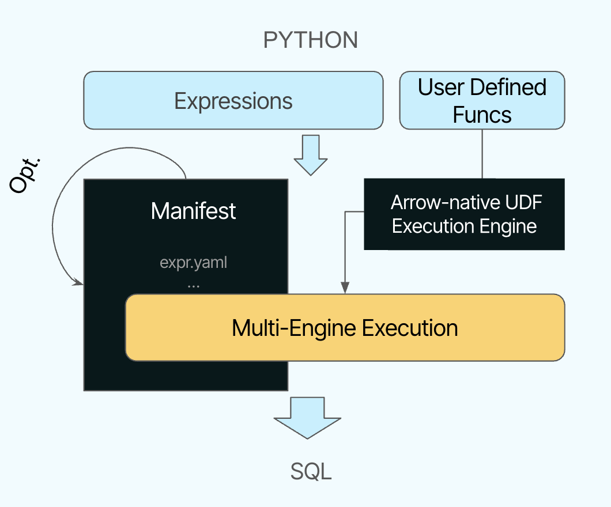

<div align="center">


</div>

> **Xorq is a batch transformation framework built on Ibis,
> DataFusion and Arrow.**
> It ships a multi-engine manifest that you can run in SQL across DuckDB,
> Snowflake, DataFusion, and more.

---

## What Xorq gives you

| Feature | Description |
|---|---|
|**Multi-engine manifest** | A single, typed plan (YAML manifest) that executes as SQL on DuckDB, Snowflake, and embedded DataFusion. |
|**Deterministic builds & caching** | Manifests are uniquely named with a deterministic hash of the expression. |
|**Lineage & schemas** | Schema checks with end-to-end, column-level lineage. |
|**Compute catalog** | Versioned registry to run, cache, diff, and manifests. |
|**Portable UDxFs** | Arbitrary Python logic with schema-in/out contracts, portable via Arrow Flight. |
|**`scikit-learn` integration** | Fit/predict pipelines serialize to a manifest for portable batch scoring with training lineage. |
|**Templates with `uv`** | `xorq init` ships a templates in **replicaple environments** |

> [!NOTE]
> **Not an orchestrator.** Use Xorq from Airflow, Dagster, GitHub Actions, etc.
> **Batch focus.** Not streaming/online—**batch**, **out-of-core** transformations.


### Supported backends

- DuckDB
- Snowflake
- BigQuery
- Postgres
- SQLite
- DataFusion (vanilla)
- Xorq-DataFusion (embedded)


## Quickstart

```bash
pip install xorq[examples]
xorq init -t penguins
```

Then follow the [Quickstart
Tutorial](https://docs.xorq.dev/tutorials/getting_started/quickstart) for a
full walk-through using the Penguins dataset.

### Project Templates

We ship minimal, opinionated starter templates so you can go from
zero-to-manifest fast.

- **Penguins:** Feature engineering + fit/predict LogisticRegression on the
Penguins dataset.
- **Digits:** Fit/predict on the Digits dataset with a full pipeline (PCA +
classifier).

Each template includes:

```bash
uv.lock — pinned dependencies for replicable envs
requirements.txt — bare minimal requirement
pyproject.toml — project metadata
expr.py  — the expr entrypoint
```

#### Requirements for environment replicability for a Project:
- TBD

## Multi-engine manifest for Machine Learning pipelines

The manifest is a collection of YAML files that captures the expression graph
and supporting files like memtables serialized to disk.

Once you xorq build your pipeline, you get:

- expr.yaml: a reproducible expression graph
- deferred_reads.yaml: source metadata
- SQL and metadata files for inspection and CI

Xorq makes it easy to bring your scikit-learn Pipeline and automatically
converts it into a deferred Xorq expression.

**Engines used**: `duckdb` to read parquet, `xorq-datafusion` for running UDFs.


```python
import xorq.api as xo
from xorq.expr.ml.pipeline_lib import Pipeline


(train, test) = xo.test_train_splits(...)
sklearn_pipeline = make_pipeline(...)
xorq_pipeline = Pipeline.from_instance(sklearn_pipeline)
# still no work done: deferred fit expression
fitted_pipeline = xorq_pipeline.fit(train, features=features, target=target)
expr = fitted_pipeline.predict(test[features])
```

Here's a commented snippet from a YAML manifest

```bash
predicted:
  op: ExprScalarUDF            # predict(...)
  kwargs:
    bill_length_mm: ...        # features
    bill_depth_mm: ...
    flipper_length_mm: ...
    body_mass_g: ...
  meta:
    __config__:
      computed_kwargs_expr:
        op: AggUDF             # fit(...)
        kwargs:
          bill_length_mm: ...
          bill_depth_mm: ...
          flipper_length_mm: ...
          body_mass_g: ...
          species: ...         # target
```

We serialize the expression as a YAML manifest that captures the graph and all
nodes (including UDFs as pickled entries); builds are addressed by its hash.

This ensures expression-level replicability and round-trippability to Python.

## From manifest to catalog

Once an expression is built, we can then catalog it and share across teams.

The compute catalog is a versioned registry of compute manifests. It can be
stored in Git, S3, GCS, or a database.

```bash
❯ xorq catalog add builds/{build-hash} --alias penguins-model
```

```
❯ xorq catalog ls
Aliases:
mortgage-test-predicted dbf90860-88b3-4b6c-830a-8518b3296e7c    r1
Entries:
dbf90860-88b3-4b6c-830a-8518b3296e7c    r1      52f987594254
```

You can then run, serve or cache the catalog entry, including unbinding nodes
that depend on external state (e.g. source tables). This is useful to serve a
trained pipeline with new data.

### Serve the same expression with new inputs (serve-unbound)

We can rerun an expression with new inputs by replacing an arbitrary node in
the expression defined by its node-hash.

```bash
xorq serve-unbound builds/7061dd65ff3c --host localhost --port 8001 --cache-dir penguins_example b2370a29c19df8e1e639c63252dacd0e
```
- `builds/7061dd65ff3c`: Your built expression manifest
- `--host localhost --port 8001`: Where to serve the UDxF from
- `--cache-dir penguins_example`: Directory for caching results
- `b2370a29c19df8e1e639c63252dacd0e`: The node-hash that represents the expression input to replace

To learn more on how to find the node hash, check out the [`serve-unbound`](https://docs.xorq.dev/tutorials/getting_started/quickstart#finding-the-node-hash) documentation.

### Compose with the served expression:

```python
import xorq.api as xo

client = xo.flight.connect("localhost", 8001)
f = client.get_exchange("default") # currently all expressions get the default name in addition to their hash

new_expr = expr.pipe(f)

new_expr.execute()
```

### Replicable environments with uv

Using the lock with Xorq

we currently using `requirements.txt` to build the uv env.

```bash
# Build using a locked env (hydrates if needed)
xorq uv-build

# Run a build
xorq uv-run builds/<hash>
```

## How Xorq works

Xorq uses Apache Arrow Flight RPC for zero-copy data transfer and leverages Ibis and
DataFusion under the hood for efficient computation.



## Use cases

A generic catalog that can be used to build new workloads:

- ML/data pipeline development (deterministic builds, caching, replicable envs)
- Lineage‑preserving, multi-engine feature stores (offline, reproducible)
- Composable data products (ship datasets as compute artifacts)
- Governed sharing of compute (catalog entries as the contract between teams)


Also great for:

- Generating SQL from high-level DSLs (e.g. Semantic Layers)
- Cross‑warehouse migrations (portability via Ibis + UDxFs)
- Data CI (Schema/lineage checks in PRs)
- ML Experiment Tracking (versioned manifests with cached results)


## Learn More

* [Why Xorq?](https://docs.xorq.dev/#why-xorq)
* [Caching Guide](https://docs.xorq.dev/core_concepts/caching)
* [Backend Profiles](https://docs.xorq.dev/api_reference/backend_configuration/profiles_api)
* [Scikit-learn Template](https://github.com/xorq-labs/xorq-template-sklearn)

## Status

Xorq is pre-1.0 and evolving fast. Expect breaking changes.

## Get Involved

* [Website](https://www.xorq.dev)
* [Discord](https://discord.gg/8Kma9DhcJG)
* [Contribute on GitHub](https://github.com/xorq-labs/xorq)
