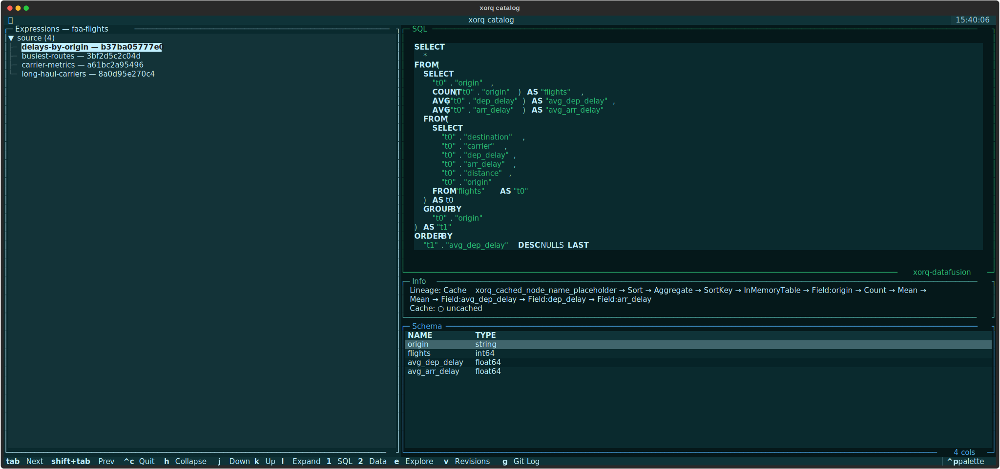

<div align="center">


**The context engine for data agents.**

[Documentation](https://docs.xorq.dev) • [Website](https://www.xorq.dev) • [Contributing](CONTRIBUTING.md)

</div>

## What is Xorq

Xorq is a context engine for data agents. You write [Ibis](https://ibis-project.org) expressions, build them into content-addressed artifacts, and catalog them under human-readable aliases. Data agents, services, and CI jobs discover and run them by name through the CLI or the Python API.

A script doesn't tell you what was actually computed or how to reuse it. The next data agent ends up doing archaeology on a folder of Python files. Xorq sits between your agent harnesses, data engines, and sandboxes. It converts Python expressions into cataloged entries that are reproducible, composable, and deployable. Every source entry carries a hash, a schema, the SQL it compiles to, and lineage.


## Quickstart

Install Xorq:

```bash
pip install xorq
# or: uv add xorq
```

Verify:

```bash
xorq --version
```

Write an expression in `pipeline.py`:

```python
import xorq.api as xo
from xorq.caching import ParquetCache

expr = (
    xo.memtable({"origin": ["JFK", "LAX", "ORD"], "delay": [10.0, -5.0, 30.0]})
    .filter(xo._.delay > 0)
    .agg(avg_delay=xo._.delay.mean())
    .cache(ParquetCache.from_kwargs())
)
```

Build it, add it to the catalog, and run it:

```bash
xorq build pipeline.py
xorq catalog init
xorq catalog add builds/<hash>/ --alias avg-delay
xorq catalog run avg-delay -o out.parquet
```

To start from a working template:

```bash
pip install "xorq[examples]"
xorq init -t penguins
```

Available templates: `penguins`, `sklearn`, `cached-fetcher`.

## Core concepts

| Concept | Description |
|---------|-------------|
| **Expression** | An Ibis expression tree Xorq can build, cache, and run across backends |
| **Build** | A content-addressed directory containing the manifest, cached data, and dependency snapshot |
| **Node hash** | A deterministic identifier for a node; same inputs always produce the same hash |
| **Catalog** | A git-backed store mapping aliases to build artifacts |
| **Cache** | Call `.cache()` on any expression node; Xorq stores and revalidates the result automatically |

## Expression kinds

Each catalog entry has a kind that determines how it can be run and composed.

| Kind | What it is |
|------|------------|
| Source | A fully bound expression with all inputs resolved |
| Partial | An expression with an open input slot; accepts Arrow IPC from stdin at runtime |
| ExprBuilder | A tagged expression backed by a semantic model (for example, a BSL `SemanticTable`) |
| Composed | Two or more catalog entries connected via `xorq catalog compose` |

Inspect the kind and schema of any catalog entry:

```bash
xorq catalog schema avg-delay
```

Output:

```
Type: Source (bound)

Schema Out:
  avg_delay                float64
```

## Catalog CLI

| Command | What it does |
|---------|--------------|
| `xorq catalog init` | Initialize a new catalog |
| `xorq catalog add <path> --alias <name>` | Add a build and assign an alias |
| `xorq catalog list` | List all catalog entries |
| `xorq catalog list-aliases` | List all aliases |
| `xorq catalog schema <alias>` | Show schema in and schema out |
| `xorq catalog run <alias> -o out.parquet` | Execute and write output |
| `xorq catalog run <alias> -o - -f csv` | Stream CSV to stdout |
| `xorq catalog compose <source> <transform>` | Build and catalog a composed expression |
| `xorq catalog tui` | Launch the terminal UI |

Pipe partial entries together:

```bash
xorq catalog run source-entry -o - -f arrow | xorq catalog run transform-entry -o - -f csv
```

## Terminal UI

Launch the TUI to browse, inspect, and run catalog entries interactively:

```bash
xorq catalog tui
```



## BSL integration

Xorq integrates with [Boring Semantic Layer](https://github.com/boringdata/boring-semantic-layer) to catalog semantic models as executable entries. You build a `SemanticTable`, query it into an expression, tag it, and add it to the catalog. Data agents can discover the entry, inspect its dimensions and measures, and run queries without knowing the underlying schema.

```python
from boring_semantic_layer import to_semantic_table
import xorq.api as xo
from xorq.catalog.catalog import Catalog

flights = xo.memtable(
    {
        "origin": ["JFK", "LAX", "ORD", "JFK", "LAX"],
        "carrier": ["AA", "UA", "AA", "UA", "AA"],
        "dep_delay": [10.0, -5.0, 30.0, 15.0, -2.0],
        "distance": [2475, 1745, 740, 1300, 2475],
    },
    name="flights",
)

model = (
    to_semantic_table(flights)
    .with_dimensions(origin=lambda t: t.origin, carrier=lambda t: t.carrier)
    .with_measures(
        flight_count=lambda t: t.count(),
        avg_delay=lambda t: t.dep_delay.mean(),
    )
)

expr = model.query(dimensions=("origin",), measures=("flight_count", "avg_delay"))
catalog = Catalog.from_repo_path("my-catalog", init=True)
catalog.add(expr.to_tagged(), aliases=("flights-by-origin",))
```

The catalog entry carries the full semantic model. You can recover it from any cataloged expression and rebind it to new data.

## Scikit-learn integration

`Pipeline.from_instance` wraps any scikit-learn pipeline in deferred execution. Intermediate results are cached automatically; the same expression runs on any backend.

**xorq**

```python
import xorq.api as xo
from xorq.expr.ml.pipeline_lib import Pipeline

iris = xo.examples.iris.fetch()
features = tuple(iris.drop("species").schema())
train, test = xo.train_test_splits(iris, 0.2)

xorq_pipeline = Pipeline.from_instance(sklearn_pipeline)
fitted = xorq_pipeline.fit(train, features=features, target="species")
predictions = test.pipe(fitted.predict)
```

The expression `predictions` is deferred — nothing runs until you call `.execute()`. See the [sklearn template](https://github.com/xorq-labs/xorq-template-sklearn) for a full example with caching and model persistence.

## Backends

Install the extras for the engines you need:

| Backend | Install | Notes |
|---------|---------|-------|
| DuckDB | `pip install "xorq[duckdb]"` | Default local engine |
| DataFusion | `pip install "xorq[datafusion]"` | Embedded engine, used for UDFs via Arrow Flight |
| PostgreSQL | `pip install "xorq[postgres]"` | Remote queries over ADBC |
| SQLite | `pip install "xorq[sqlite]"` | Lightweight local SQL |
| Snowflake | `pip install "xorq[snowflake]"` | Cloud warehouse via ADBC |
| Apache Iceberg | `pip install "xorq[pyiceberg]"` | Open table format |

Connect to any backend and move data between them:

```python
import xorq.api as xo

pg   = xo.postgres.connect(host="localhost", database="mydb", user="me")
duck = xo.duckdb.connect()

# pull two tables from postgres, asof-join in duckdb, write result back to postgres
events  = pg.table("events").into_backend(duck)
prices  = pg.table("prices").into_backend(duck)
joined  = events.asof_join(prices, on="ts", by="symbol")[["ts", "symbol", "price"]]
result  = joined.into_backend(pg)
```

Xorq handles data transit between backends automatically.

## Development

See [CONTRIBUTING.md](CONTRIBUTING.md) for setup instructions, including how to install all extras, activate the virtual environment, and run the test suite.

---

Pre-1.0. Expect breaking changes with migration guides.
