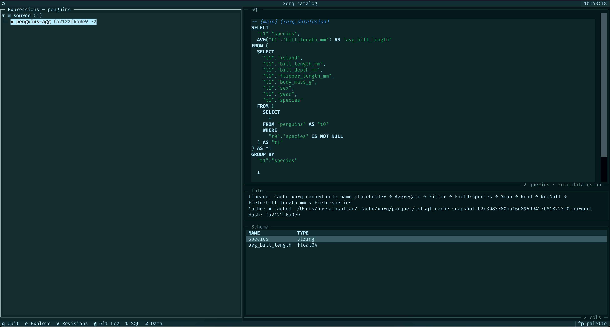
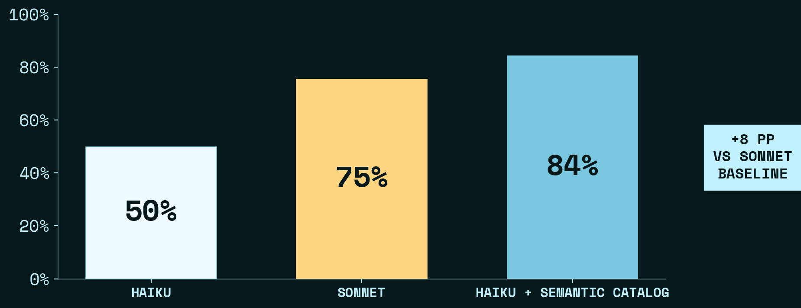

<div align="center">


[Documentation](https://docs.xorq.dev) • [Website](https://www.xorq.dev) • [Claude Code plugin](https://github.com/xorq-labs/claude-plugins)
</div>

---
Xorq is an executable memory system for tabular data work. Xorq gives
agents a catalog of executable pipelines instead of markdown notes. It
turns ephemeral agent work — pandas scripts, sklearn pipelines, ad-hoc
tables, "works on my sandbox" environments — into durable, composable,
executable artifacts that any future agent or human can reproduce and
reuse.

It comes with a CLI for agents and a TUI for humans with a git-native catalog.


---
# The Problem

You ask a coding agent to build a dashboard. A few hours later you have one,
along with a folder of one-off Python scripts that import each other in
non-obvious ways, an embedded JSON holding intermediate state, and a
`requirements.txt` that was last regenerated two sessions ago. It runs
end-to-end on your laptop. Reproducing it on another machine, or
productionizing any of it, means rewriting most of it.

| Pain | Symptom |
|------|---------|
| **No memory of how** | An agent run leaves you with a folder of `.py`, `.json`, and `.html` files. To reproduce the result you re-run the scripts in the right order, with the right state. |
| **No shared memory** | Two agents working the same task can't see each other's caches, so the same join runs in both sessions. When a cache does get reused ad-hoc, it can hand back stale results without warning. |
| **No memory of what** | Agents describe what they did in prose. There is no versioned artifact to point at, so supervision means reading transcripts. |
| **No memory of dependencies** | Someone renames a column upstream and a downstream model breaks. The dependency between them was never recorded outside the chat that produced them. |
| **No memory across environments** | A pipeline that ran in one agent session has no path to another sandbox, your machine, or production. There is no shared store to publish to and no environment captured that you could rebuild from. |

# Two ways to start

**With an agent.** Install the Xorq plugin in Claude Code and let it build
catalogs for you:

```
/plugin marketplace add xorq-labs/claude-plugins
/plugin install xorq@xorq-plugins
```

The plugin adds four slash commands:

- `/xorq:init` — load CSV or Parquet files as catalog entries
- `/xorq:catalog-explore` — browse what's already in a catalog
- `/xorq:composer` — combine entries into new joined/aliased entries
- `/xorq:builder` — assemble ML pipelines and semantic-layer entries

The agent does the building; you keep the catalog.

**Manually.** Install the library and start composing expressions in Python:

```bash
❯ pip install xorq[examples]
❯ xorq init -t penguins
```
---

# Design choices

| Choice | What it enables |
|--------|-----------------|
| **Ibis as expression system** | Declarative dataframe expressions that compile to many engines. |
| **Git for state and storage** | The catalog is a git repo of entries.  |
| **uv for reproducible environments** | Each entry ships with a wheel and pinned `requirements.txt`. |
| **DataFusion for embedded compute** | Pipelines execute in-process SQL and UDF execution |
| **Arrow for IPC and network** | Operators exchange Arrow RecordBatches |


# Supported engines

The same expression can run against any of these backends, and `into_backend`
moves data between them.

| Category | Engines |
|----------|---------|
| **Embedded** | DataFusion, DuckDB, SQLite, pandas |
| **Warehouses** | Snowflake, Databricks, Trino, Postgres |
| **Lakehouse** | PyIceberg |
| **Arrow Flight** | GizmoSQL |


# Comparison

Agent memory tools (Mem0) store markdown the LLM reads
into context — fine for narrative, not for tabular data where LLMs
can't be trusted to do arithmetic. Xorq's items execute against an
engine, with provenance and reproducibility guarantees.

| Approach | Memory item | Answer produced by | Provenance & reproducibility |
|----------|-------------|---------------------|-------------------------------|
| Agent memory (Mem0, etc) | Markdown snippets | LLM reading the prompt | None |
| MCP / open context servers | Tool bindings | Tool at runtime; LLM consumes as text | Per-tool |
| dbt | SQL model files | Warehouse executing compiled SQL | `manifest.json` captures lineage; env (warehouse, packages) pinned externally |
| **Xorq** | Content-addressed expression + pinned env | Engine executing the expression | `expr.yaml` + uv-pinned env shipped with the artifact |


# Benchmark

On [DABStep](https://huggingface.co/spaces/adyen/DABstep) — 450 data-analysis
questions over payment transaction data — a Xorq semantic catalog of 33 named
expressions takes Haiku from 50% to 84%, 8pp above the Sonnet baseline.



Where the agent looks for context mattered more than which base model it
used. Full write-up:
[Orientation Over Reasoning](https://xorq.dev/blog/orientation-over-reasoning/).


# Under the hood

<details open>
<summary><b>The Expression</b> — declarative Ibis, multi-engine, Arrow-native</summary>

Write declarative Ibis expressions that run like a tool. Xorq extends Ibis with
caching, multi-engine execution, and UDFs. Below, `xo._` is the Ibis row
reference — `xo._.species` refers to the `species` column of the current table.

```python
import xorq.api as xo
from xorq.caching import ParquetCache

penguins = xo.examples.penguins.fetch()

penguins_agg = (
    penguins
    .filter(xo._.species.notnull())
    .group_by("species")
    .agg(avg_bill_length=xo._.bill_length_mm.mean())
)

expr = (
    penguins_agg
    .cache(ParquetCache.from_kwargs())
)
```

### One expression, many engines

```python
expr = penguins.into_backend(xo.sqlite.connect())
expr.ls.backends
```
```
(<xorq.backends.sqlite.Backend at 0x107debda0>,
 <xorq.backends.xorq_datafusion.Backend at 0x1669002c0>)
```

### Expressions are tools, Arrow is the pipe

Unix gave us small programs that compose via stdout. Xorq gives you expressions
that compose via Arrow.

```
In [6]: expr.to_pyarrow_batches()
Out[6]: <pyarrow.lib.RecordBatchReader at 0x15dc3f570>
```

### Workflows, without state

Xorq executes expressions as Arrow RecordBatch streams — no DAG of tasks to
checkpoint, just data flowing through transforms.

### Scikit-learn pipelines

Xorq translates `scikit-learn` Pipeline objects to deferred expressions via
`Pipeline.from_instance(sklearn_pipeline)`. End-to-end sklearn examples live in
[xorq-labs/xorq-gallery](https://github.com/xorq-labs/xorq-gallery).

</details>

<details>
<summary><b>The Catalog</b> — a git repo of build artifacts on the filesystem</summary>

The catalog is a git repo of build artifacts on filesystem. `xorq catalog add`
packages a build directory -- manifest (`expr.yaml` + `*_metadata.json`),
Python environment via `uv` -- into an entry.

### Build and add

```bash
❯ xorq uv build expr.py
Building wheel...
Successfully built ...
builds/fa2122f6a9e9

❯ xorq catalog -p git-catalogs/penguins init
Initialized catalog at /git-catalogs/penguins

❯ xorq catalog add builds/fa2122f6a9e9/ -a penguins-agg
Added fa2122f6a9e9
```

### Git history

Every catalog operation is a commit you can read:

```
❯ git -C git-catalogs/penguins reflog
17dd4e9 (HEAD -> main) HEAD@{0}: add: fa2122f6a9e9 (aliases penguins-agg)
9f5d242 HEAD@{1}: add catalog.yaml
9915df3 HEAD@{2}: commit: Switching to main
```

### Catalog layout

```
❯ tree git-catalogs/penguins
git-catalogs/penguins
├── aliases
│   └── penguins-agg.zip -> ../entries/fa2122f6a9e9.zip
├── entries
│   └── fa2122f6a9e9.zip
├── metadata
│   └── fa2122f6a9e9.zip.metadata.yaml
└── catalog.yaml
```

Aliases are symlinks, entries are zipped builds, and metadata sidecars are
plain YAML. An agent that clones the repo can discover everything with file
operations — no service to call, no API to learn:

```bash
# List aliased entries
❯ ls git-catalogs/penguins/aliases/

# Find entries that emit an 'avg_bill_length' column
❯ grep -l 'avg_bill_length' git-catalogs/penguins/metadata/*.yaml

# Find entries running on DataFusion
❯ grep -l 'xorq_datafusion' git-catalogs/penguins/metadata/*.yaml

# Find source entries (vs. unbound, expr_builder kinds)
❯ grep -l 'kind: source' git-catalogs/penguins/metadata/*.yaml
```

### Inside an entry

A build directory contains the manifest plus everything needed to reproduce
it. The zipped build is the entry stored in the catalog.

```
❯ tree builds/fa2122f6a9e9
├── build_metadata.json
├── expr.yaml
├── expr_metadata.json
├── profiles.yaml
├── requirements.txt
└── xorq-0.3.24-py3-none-any.whl
```

The manifest (`expr.yaml` + `*_metadata.json`) is the content-addressed
specification of the pipeline. The **entry** packages it with deps and source
for reproducible execution.

```yaml
# Input-addressed, composable, portable
# Abridged expr.yaml
definitions:
  nodes:
    '@read_b5f228c91f16':
      op: Read
      method_name: read_parquet
      name: penguins
      read_kwargs:
        - [hash_path, .../penguins/20250703T145709Z-c3cde/penguins.parquet]
        - [table_name, penguins]
      schema_ref: schema_f11dda6745cc

    '@filter_fa4a3fde7765':
      op: Filter
      parent: { node_ref: '@read_b5f228c91f16' }
      predicates:
        - { op: NotNull, arg: { op: Field, name: species, ... } }

    '@aggregate_eb3109707390':
      op: Aggregate
      parent: { node_ref: '@filter_fa4a3fde7765' }
      by:
        species: { op: Field, name: species, ... }
      metrics:
        avg_bill_length:
          op: Mean
          arg: { op: Field, name: bill_length_mm, ... }

    '@cachednode_fa2122f6a9e9':
      op: CachedNode
      parent: { node_ref: '@aggregate_eb3109707390' }
      cache:
        type: ParquetCache
        relative_path: parquet
      schema_ref: schema_9271d5e9d443

expression:
  node_ref: '@cachednode_fa2122f6a9e9'
  schema_ref: { schema_ref: schema_9271d5e9d443 }
```

</details>

<details>
<summary><b>The Tools</b> — catalog, run, serve</summary>

The entry is the unit of executable context that includes the manifest plus
environment to run it. The tools — catalog, run, serve — are how agents and
humans compose with it.

### Catalog

Once an entry is published, agents discover it straight from the catalog
filesystem — `metadata/*.yaml` sidecars sit next to the zipped entries, so
listing, filtering, and lookup-by-alias/hash all work with plain file reads
and `git` (no service required). Humans open the TUI to preview data,
schema, lineage, and git history side-by-side.

```bash
❯ xorq catalog list-aliases
penguins-agg

❯ xorq catalog list
fa2122f6a9e9
```

### Run

```bash
❯ xorq run builds/fa2122f6a9e9 -o out.parquet
```
Additionally, you can serve an unbound expression over Arrow Flight. with `xorq
serve-*` commands.

</details>

---

# Learn more

- [Quickstart](https://docs.xorq.dev/getting_started/quickstart)
- [Why xorq?](https://docs.xorq.dev/#why-xorq)
- [Claude Code plugin](https://github.com/xorq-labs/claude-plugins)
- [Scikit-learn ](https://github.com/xorq-labs/xorq-template-sklearn)
- [A Git-Native Semantic Layer](https://xorq.dev/blog/bsl-xorq/) — building a portable semantic catalog with Xorq
- [Orientation Over Reasoning](https://xorq.dev/blog/orientation-over-reasoning/) — Haiku + Xorq catalog hits 84% on DABStep, above the Sonnet baseline

---

Pre-1.0. Expect breaking changes with migration guides.
