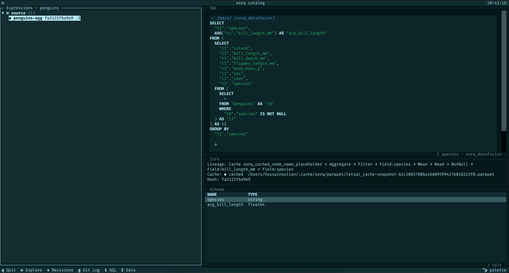

<div align="center">


[Documentation](https://docs.xorq.dev) • [Website](https://www.xorq.dev) • [Claude Code plugin](https://github.com/xorq-labs/claude-plugins)
</div>

---
Xorq is an executable, composable catalog for tabular data work. It gives
agents runnable, content-addressed pipelines instead of markdown notes: memory
you can execute, not prose you have to reread. Entries compose, so new
pipelines build on cataloged ones instead of starting from scratch. It turns
ephemeral agent work such as pandas scripts, sklearn pipelines, ad-hoc tables
into durable artifacts that any future agent or human can discover, reproduce
and reuse.

It comes with a CLI for agents and a TUI for humans with a git-native catalog.


# Xorq in 60 seconds

Think of Xorq as giving a dataframe pipeline a **reproducible identity**.

### 1. Define the pipeline

You start with a lazy dataframe expression:

```python
import xorq.api as xo

penguins = xo.examples.penguins.fetch()
penguins_agg = (
    penguins
    .filter(xo._.species.notnull())
    .group_by("species")
    .agg(avg_bill_length=xo._.bill_length_mm.mean())
)
```

This describes the transformation: filter the penguins data, group it by
species, and calculate the average bill length. Unlike a sequence of scripts
that must be executed in the right order, the expression gives Xorq a
structured representation of the computation.

### 2. Build it

Save the expression in `expr.py`, then build it into a reproducible artifact:

```bash
xorq uv build expr.py
```

Xorq produces a hashed build directory:

```text
builds/fa2122f6a9e9/
├── expr.yaml
├── expr_metadata.json
├── requirements.txt
└── xorq-<version>-py3-none-any.whl
```

The manifest (`expr.yaml` + `*_metadata.json`) is the content-addressed
specification of the pipeline. It captures the computation, including its
operations, schema, lineage, and inputs. The build packages that
specification with the environment needed to reproduce and execute it.

### 3. Add it to a catalog

Add the build to a catalog:

```bash
xorq catalog add builds/fa2122f6a9e9/ -a penguins-agg
```

The catalog is a Git repository of these entries. An entry can be discovered
by its hash or by a human-readable alias such as `penguins-agg`.

The flow is:

```text
Dataframe expression
        ↓
    xorq uv build
        ↓
Content-addressed specification
        +
Reproducible environment
        ↓
   Catalog entry
        ↓
     Git repo
        ↓
 Humans / CI / agents
```

Another human or agent can now discover, reproduce, run, or compose that
pipeline without reconstructing the original work from scripts, environment
setup, and chat history.

That is the core idea behind Xorq's executable catalog: instead of remembering
a description of what happened, the catalog keeps the computation itself.

---
# The Problem

Coding agents are great at accomplishing closed-loop task but in the process
accumulate tech-debt and unnecessary complexity. For example, if you ask a
coding agent to build a dashboard, you are more likely than not to get a folder
of one-off Python scripts that import each other in non-obvious ways, an
embedded JSON holding intermediate state, and a `requirements.txt` that was
last regenerated two sessions ago. It may also execute end-to-end on your
laptop. Verifying by reproducing on another machine, or productionizing any of
it, means rewriting some of it. And every time you rewrite, more complexity
gets introduced.


| Pain | Symptom |
|------|---------|
| **Imperative, stateful artifacts** | An agent run leaves you with a folder of `.py`, `.json`, and `.html` files. Reproducing the result means re-running them in the right order without a declarative spec |
| **No discoverable, shared index** | "Team memory" today is `~/.claude/memory/*.md`, with a `MEMORY.md` index of one-liners pointing to the notes. There's no executable catalog two agents can both pull into context |
| **No lineage graph** | Rename a column upstream and a downstream model breaks at runtime. The dependency lived only in chat history, not in a graph that could have flagged it before it shipped. |
| **No portable environment** | A pipeline that ran in one agent session has no path to another sandbox, your machine, or production.|

# Two ways to start

**With an agent.** Install the Xorq plugin in Claude Code and let it build
catalogs for you:

```
/plugin marketplace add xorq-labs/claude-plugins
/plugin install xorq@xorq-plugins
```

The plugin adds four slash commands:

- `/xorq:init` — load CSV or Parquet files as catalog entries
- `/xorq:catalog-explore` — browse what's already in a catalog
- `/xorq:composer` — combine entries into new joined/aliased entries
- `/xorq:builder` — assemble ML pipelines and semantic-layer entries

The agent does the building; you keep the catalog.

**Manually.** Install the library and start composing expressions in Python:

```bash
❯ pip install xorq[examples]
❯ xorq init -t penguins
```
---

# Design choices

| Choice | What it enables |
|--------|-----------------|
| **[Ibis](https://ibis-project.org/) as expression system** | Declarative dataframe expressions that compile to many engines. |
| **[Git](https://git-scm.com/) for state and storage** | The catalog is a git repo of entries with git-annex support for large files  |
| **[uv](https://docs.astral.sh/uv/) for reproducible environments** | Each entry ships with a wheel and pinned `requirements.txt`. |
| **[DataFusion](https://datafusion.apache.org/) for embedded compute** | Pipelines execute in-process SQL and UDF execution |
| **[Arrow](https://arrow.apache.org) for IPC and network** | Operators exchange Arrow RecordBatches |


# Supported engines

The same expression can run against any of these backends, and `into_backend`
moves data between them.

| Category | Engines |
|----------|---------|
| **Embedded** | DataFusion, DuckDB, SQLite, pandas |
| **Warehouses** | Snowflake, Databricks, Trino, Postgres |
| **Lakehouse** | PyIceberg |
| **Arrow Flight** | GizmoSQL |


# Comparison

Xorq is complementary to general-purpose data catalogs. Atlan, Collibra, and
Unity Catalog inventory and govern the assets you already have: descriptions,
owners, glossaries, policies, permissions, harvested lineage. Xorq catalogs the
computation, so an entry is something you run, not something you read about.

| Dimension | Xorq | Atlan, Collibra, Unity Catalog |
|-----------|------|--------------------------------|
| Cataloged unit | Content-addressed expression plus pinned environment | Metadata record over an existing table |
| Result of a lookup | Arrow stream from running the entry | A governed table you query with external code |
| Lineage | Read off the manifest, exact by construction | Harvested from executed queries, best effort |
| Operating model | Git repo of build artifacts on disk, no service to call | Hosted metastore and control plane |
| Portability | Same expression runs on DataFusion, DuckDB, Snowflake, Databricks | Bound to the host platform |
| Primary contributors | Agents and engineers composing new pipelines | Stewards, analysts, compliance teams |
| Out of scope | Glossaries, ownership workflows, policy, access control | Packaging the pipeline and its environment |

A governance catalog tells you what data exists, who owns it, and who may read
it. Xorq tells an agent what to run to get the same answer twice and humans how
it arrived at that answer. Read governed tables through the Databricks or
Snowflake backend, and register entries as assets.


# Benchmark

On [DABStep](https://huggingface.co/spaces/adyen/DABstep) — 450 data-analysis
questions over payment transaction data — a Xorq semantic catalog of 33 named
expressions takes Haiku from 50% to 84%, 8pp above the Sonnet baseline.


Where the agent looks for context mattered more than which base model it
used. Full write-up:
[Orientation Over Reasoning](https://xorq.dev/blog/orientation-over-reasoning/).


# Under the hood

<details open>
<summary><b>The Expression</b> — declarative Ibis, multi-engine, Arrow-native</summary>

Write declarative Ibis expressions that run like a tool. Xorq extends Ibis with
caching, multi-engine execution, and UDFs. Below, `xo._` is the Ibis row
reference — `xo._.species` refers to the `species` column of the current table.

```python
import xorq.api as xo
from xorq.caching import ParquetCache

penguins = xo.examples.penguins.fetch()

penguins_agg = (
    penguins
    .filter(xo._.species.notnull())
    .group_by("species")
    .agg(avg_bill_length=xo._.bill_length_mm.mean())
)

expr = (
    penguins_agg
    .cache(ParquetCache.from_kwargs())
)
```

### One expression, many engines

```python
expr = penguins.into_backend(xo.sqlite.connect())
expr.ls.backends
```
```
(<xorq.backends.sqlite.Backend at 0x107debda0>,
 <xorq.backends.xorq_datafusion.Backend at 0x1669002c0>)
```

### Expressions are tools, Arrow is the pipe

Unix pipes text streams between small programs. Xorq pipes Arrow streams
between expressions.

`unix : programs :: xorq : arrow-transforms`

```
In [6]: expr.to_pyarrow_batches()
Out[6]: <pyarrow.lib.RecordBatchReader at 0x15dc3f570>
```

### Workflows, without state

Xorq executes expressions as Arrow RecordBatch streams — no DAG of tasks to
checkpoint, just data flowing through transforms.

### Scikit-learn pipelines

Xorq translates `scikit-learn` Pipeline objects to deferred expressions via
`Pipeline.from_instance(sklearn_pipeline)`. End-to-end sklearn examples live in
[xorq-labs/xorq-gallery](https://github.com/xorq-labs/xorq-gallery).

</details>

<details>
<summary><b>The Catalog</b> — a git repo of build artifacts on the filesystem</summary>

The catalog is a git repo of build artifacts on filesystem. `xorq catalog add`
packages a build directory -- manifest (`expr.yaml` + `*_metadata.json`),
Python environment via `uv` -- into an entry.

### Build and add

```bash
❯ xorq uv build expr.py
Building wheel...
Successfully built ...
builds/fa2122f6a9e9

❯ xorq catalog -p git-catalogs/penguins init
Initialized catalog at /git-catalogs/penguins

❯ xorq catalog add builds/fa2122f6a9e9/ -a penguins-agg
Added fa2122f6a9e9
```

### Git history

Every catalog operation is a commit you can read:

```
❯ git -C git-catalogs/penguins reflog
17dd4e9 (HEAD -> main) HEAD@{0}: add: fa2122f6a9e9 (aliases penguins-agg)
9f5d242 HEAD@{1}: add catalog.yaml
9915df3 HEAD@{2}: commit: Switching to main
```

### Catalog layout

```
❯ tree git-catalogs/penguins
git-catalogs/penguins
├── aliases
│   └── penguins-agg.zip -> ../entries/fa2122f6a9e9.zip
├── entries
│   └── fa2122f6a9e9.zip
├── metadata
│   └── fa2122f6a9e9.zip.metadata.yaml
└── catalog.yaml
```

Aliases are symlinks, entries are zipped builds, and metadata sidecars are
plain YAML. An agent that clones the repo can discover everything with file
operations — no service to call, no API to learn:

```bash
# List aliased entries
❯ ls git-catalogs/penguins/aliases/

# Find entries that emit an 'avg_bill_length' column
❯ grep -l 'avg_bill_length' git-catalogs/penguins/metadata/*.yaml

# Find entries running on DataFusion
❯ grep -l 'xorq_datafusion' git-catalogs/penguins/metadata/*.yaml

# Find source entries (vs. unbound, expr_builder kinds)
❯ grep -l 'kind: source' git-catalogs/penguins/metadata/*.yaml
```

### Inside an entry

A build directory contains the manifest plus everything needed to reproduce
it. The zipped build is the entry stored in the catalog.

```
❯ tree builds/fa2122f6a9e9
├── build_metadata.json
├── expr.yaml
├── expr_metadata.json
├── profiles.yaml
├── requirements.txt
└── xorq-0.3.24-py3-none-any.whl
```

The manifest (`expr.yaml` + `*_metadata.json`) is the content-addressed
specification of the pipeline. The **entry** packages it with deps and source
for reproducible execution.

```yaml
# Input-addressed, composable, portable
# Abridged expr.yaml
definitions:
  nodes:
    '@read_b5f228c91f16':
      op: Read
      method_name: read_parquet
      name: penguins
      read_kwargs:
        - [hash_path, .../penguins/20250703T145709Z-c3cde/penguins.parquet]
        - [table_name, penguins]
      schema_ref: schema_f11dda6745cc

    '@filter_fa4a3fde7765':
      op: Filter
      parent: { node_ref: '@read_b5f228c91f16' }
      predicates:
        - { op: NotNull, arg: { op: Field, name: species, ... } }

    '@aggregate_eb3109707390':
      op: Aggregate
      parent: { node_ref: '@filter_fa4a3fde7765' }
      by:
        species: { op: Field, name: species, ... }
      metrics:
        avg_bill_length:
          op: Mean
          arg: { op: Field, name: bill_length_mm, ... }

    '@cachednode_fa2122f6a9e9':
      op: CachedNode
      parent: { node_ref: '@aggregate_eb3109707390' }
      cache:
        type: ParquetCache
        relative_path: parquet
      schema_ref: schema_9271d5e9d443

expression:
  node_ref: '@cachednode_fa2122f6a9e9'
  schema_ref: { schema_ref: schema_9271d5e9d443 }
```

</details>

<details>
<summary><b>The Tools</b> — catalog, run, serve</summary>

The entry is the unit of the catalog: the manifest plus the environment to run
it. The tools — catalog, run, serve — are how agents and humans compose with
it.

### Catalog

Once an entry is published, agents discover it straight from the catalog
filesystem — `metadata/*.yaml` sidecars sit next to the zipped entries, so
listing, filtering, and lookup-by-alias/hash all work with plain file reads
and `git` (no service required). Humans open the TUI to preview data,
schema, lineage, and git history side-by-side.

```bash
❯ xorq catalog list-aliases
penguins-agg

❯ xorq catalog list
fa2122f6a9e9
```

### Run

```bash
❯ xorq run builds/fa2122f6a9e9 -o out.parquet
```
Additionally, you can serve an unbound expression over Arrow Flight. with `xorq
serve-*` commands.

</details>

---

# Learn more

- [Quickstart](https://docs.xorq.dev/getting_started/quickstart)
- [Why xorq?](https://docs.xorq.dev/#why-xorq)
- [Claude Code plugin](https://github.com/xorq-labs/claude-plugins)
- [Scikit-learn ](https://github.com/xorq-labs/xorq-template-sklearn)
- [A Git-Native Semantic Layer](https://xorq.dev/blog/bsl-xorq/) — building a portable semantic catalog with Xorq
- [Orientation Over Reasoning](https://xorq.dev/blog/orientation-over-reasoning/) — Haiku + Xorq catalog hits 84% on DABStep, above the Sonnet baseline

---

Pre-1.0. Expect breaking changes with migration guides.
