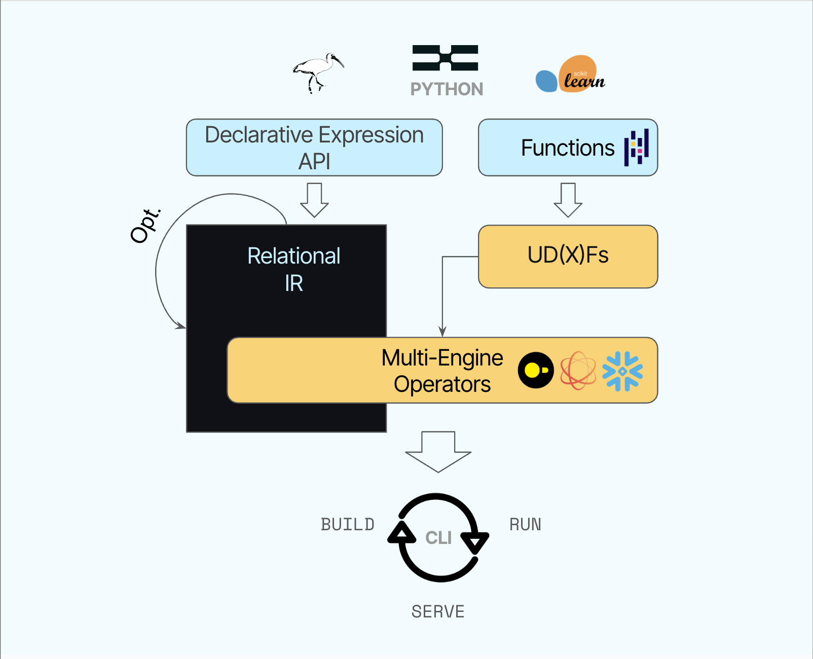

Popular Python tools like pandas and Ibis make data exploration enjoyable—but
when it's time to build reliable ML pipelines across multiple engines, things
quickly become complex.

Stitching these elements together into a reliable pipeline? It's still painful.
Each step often speaks a different language, needs constant babysitting, and
quickly becomes fragile.

That's exactly why we built **Xorq**. [More here](## Why Xorq?).

Xorq lets you:

* **Write expressive, pandas-style transformations** without memory constraints.
* **Move between SQL engines and Python** within a single declarative pipeline.
* **Build portable UDFs** that run consistently across engines
* **Serve cached intermediate results**, so no computation is wasted.
* **Save diff-able YAML artifacts** for reproducibility and CI/CD.
* **Get compile-time validation** through declarative expressions.

## Demo Time!

Let's see Xorq in action.

### Step 1: Install Xorq

```bash
pip install xorq  # Note: xorq is still pre-1.0!
```

### Step 2: Create a pipeline

```python
import xorq as xo
import xorq.expr.datatypes as dt

@xo.udf.make_pandas_udf(
    schema=xo.schema({"title": str, "url": str}),
    return_type=dt.bool,
    name="url_in_title",
)
def url_in_title(df):
    return df.apply(lambda s: (s.url or "") in (s.title or ""), axis=1)

con = xo.connect()
expr = (
    xo.deferred_read_parquet(con, "hn-data.parquet", "hn")
    .mutate(url_in_title=url_in_title.on_expr)
)

print(expr.execute().head())
```

### Step 3: Serialize your pipeline

```bash
xorq build pipeline.py -e expr --target-dir builds/
```
The CLI creates reproducible build artifacts:

```
builds/
└── fce90c2d4bb8/
    ├── expr.yaml
    ├── deferred_reads.yaml
    ├── *.sql
    └── metadata.json
```

Ship these anywhere—CI systems, teammates, or other engines—and results remain consistent.

## How Xorq works




Xorq uses Apache Arrow for zero-copy data transfer and leverages Ibis and
DataFusion under the hood for efficient computation.

## Why Xorq?

Here's the challenge we faced:

* **SQL engines** like Snowflake or DuckDB excel at heavy computation but often feel disconnected from Python workflows.
* **Python libraries** like pandas and scikit-learn are fantastic for complex transformations but struggle with scale.
* **Python UDFs** handle custom logic beautifully, yet orchestrating them across engines can get cumbersome.
* **Caching intermediate results** should save precious compute resources but isn't always automatic.
* **Automated column-level lineage** is crucial for reproducibility but usually an afterthought.
* **Fail-fast pipelines** should give feedback at compile time, not runtime—but current solutions rarely achieve this.

We built Xorq because existing tools fall short:

* **Ibis** is great for SQL but is single-engine/single-session.
* **PySpark** is complex and heavyweight for many use cases, especially when you just need a simple pipeline.
* **Airflow** is powerful but overkill for many ML workflows with state management and task-level retries.
* **dbt** lets you compose SQL models but not Python functions.
* **Feast** provides feature management and serving but lacks batch transformations.

Xorq’s key differentiators are:

* **Multi-engine workflows**: Combine Snowflake, DuckDB, and Python effortlessly.
* **Built-in caching**: No repeated expensive joins or wasted resources.
* **Serializable pipelines**: YAML and SQL artifacts for reproducibility and easy deployment.
* **Portable UDxFs**: Write your logic once and run it anywhere supported by DataFusion.


## Current Limitations

We're upfront about what’s not quite there yet:

* **API Stability**: Xorq is rapidly evolving, and breaking changes are common until v1.0.
* **Single-Machine**: We don't have distributed support for `xorq-datafusion` engine.
* **Documentation Gaps**: Docs are improving but still thin in areas.

### Out of Scope (for now)

* Real-time sources (Kafka, Pulsar, etc.)
* Rust-based UDFs
* R, Javascript, or other language support

We'd love your feedback! Your ⭐, issues, and contributions help us shape Xorq's future.


## Installation Requirements

```bash
pip install xorq  # or pip install "xorq[examples]"
```
* Python 3.9+
* Apache Arrow 10.0+

## FAQ

### **What exactly does Xorq replace in my existing data stack?**

Xorq simplifies your pipeline by combining SQL engine efficiency, pandas-style
Python workflows, caching, and reproducibility into a single tool. It can
replace or complement parts of Airflow, PySpark, dbt, Feast, or manual
pandas-based ETL pipelines, streamlining your workflow significantly.

### **Can I use my existing Python UDFs in Xorq?**

Yes! Xorq makes it easy to adapt existing pandas-style UDFs into portable UDxFs
that run consistently across multiple SQL engines and Python contexts. Simply
wrap your logic with Xorq’s decorators, and your UDFs become multi-engine
compatible automatically.

### **Is Xorq ready for production workloads?**

Xorq is rapidly evolving and still pre-1.0, meaning breaking changes are
expected as the API stabilizes. While many teams use Xorq successfully in their
workflows today, we recommend caution in production environments and encourage
active involvement to help shape the stable release.

## Getting Involved

Interested? Dive deeper:

* Read the [full article](https://www.xorq.dev/posts/introducing-xorq).
* Join the discussion on Discord: [#xorq](https://discord.gg/8Kma9DhcJG).
* Contribute via [GitHub](https://github.com/xorq-labs/xorq).

## License & Acknowledgements

Xorq is licensed under [Apache 2.0](https://github.com/xorq-labs/xorq/blob/main/LICENSE).

This project heavily relies on [Ibis](https://github.com/ibis-project/ibis) and [DataFusion](https://github.com/apache/datafusion).
