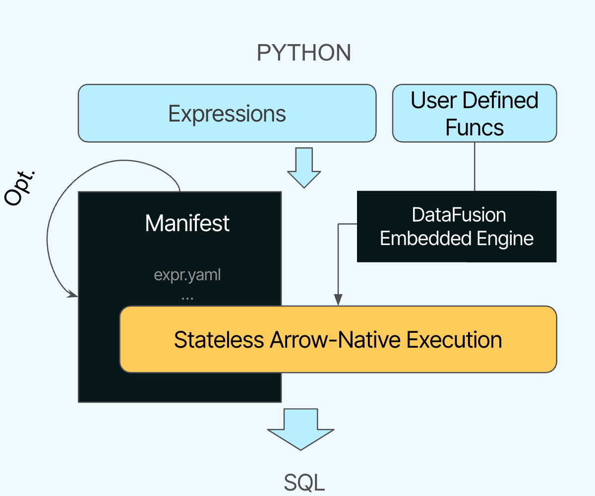

<div align="center">


</div>

> **Xorq is a multi‑engine batch transformation framework.**
> It ships a **compute catalog**—versioned expression format (Python/Ibis) you
> can run across DuckDB, Snowflake, DataFusion, and more.

---

## What Xorq is

- 🧠 **Compute catalog:** A registry of declarative transformations as
  diffable, addressable manifest (`expr.yaml`).
- 🔁 **Deterministic builds & caching:** Content‑addressed (expr‑hash) naming
  for repeatable runs and cheap replays/backfills.
- 🧩 **Portable UDXFs:** User‑Defined (Aggregate) Functions serialized once,
  reused across engines.
- 🔬 **Lineage & schema checks:** Column‑level lineage and compile‑time
  relational integrity.
- 🤖 **Scikit‑learn integration:** Treat estimators/pipelines as compute—**fit** as an aggregate step, **predict** as a scalar step—parameters are serialized into the catalog for portable batch scoring.

> **Not an orchestrator.** Use Xorq from Airflow, Dagster, Prefect, GitHub
> Actions, etc.
> **Not streaming/online.** Xorq focuses on **batch** transformations.


## Quickstart

```bash
pip install xorq[examples]
xorq init -t penguins
```

Then follow the [Quickstart Tutorial](https://docs.xorq.dev/tutorials/getting_started/quickstart) for a full walk-through using the Penguins dataset.

## Core concepts

- Expression Format: Python expressions captured as YAML (expr.yaml) for reproducible, engine‑portable compute.
- Deferred reads: Source metadata captured in deferred_reads.yaml.
- Profiles: Pluggable backends (e.g., DuckDB, Snowflake, DataFusion) selected at run time.
- UDxFs: User‑Defined Exchange Functions (UDF/UDAF) packaged for cross‑engine reuse.

## Compute Catalog & Manifest

The manifest is a collection of YAML files that captures the expression graph,
UDxF:

Once you xorq build your pipeline, you get:

- expr.yaml: a reproducible expression graph
- deferred_reads.yaml: source metadata
- SQL and metadata files for inspection and CI

Xorq makes it easy to bring your scikit-learn Pipeline and automatically
converts it into a deferred Xorq expression.

```python
(train, test) = xo.test_train_split(...)
sklearn_pipeline = make_pipeline(...)
xorq_pipeline = Pipeline.from_instance(sklearn_pipeline)
# still no work done: deferred fit expression
fitted_pipeline = xorq_pipeline.fit(train, features=features, target=target)
expr = fitted_pipeline.predict(test[features])
```

Conceptual shape (what the catalog captures) when converting to a YAML manifest:

```bash
predicted:
  op: ExprScalarUDF            # predict(...)
  kwargs:
    bill_length_mm: ...        # features
    bill_depth_mm: ...
    flipper_length_mm: ...
    body_mass_g: ...
  meta:
    __config__:
      computed_kwargs_expr:
        op: AggUDF             # fit(...)
        kwargs:
          bill_length_mm: ...
          bill_depth_mm: ...
          flipper_length_mm: ...
          body_mass_g: ...
          species: ...         # target

```

Once an expression is built, we can then catalog it and share across teams.

The compute catalog is a versioned registry of compute manifest. It can be
stored in Git, S3, GCS, or a database.

```bash
❯ xorq catalog add builds/{build-hash} --alias penguin_model
```

```
❯ xorq catalog ls
Aliases:
mortgage-test-predicted dbf90860-88b3-4b6c-830a-8518b3296e7c    r1
Entries:
dbf90860-88b3-4b6c-830a-8518b3296e7c    r1      52f987594254
```

You can then run, serve or cache the catalog entry, including unbinding nodes
that depend on external state (e.g. source tables). This is useful to serve a
trained pipeline with new data.

## How Xorq works

Xorq uses Apache Arrow for zero-copy data transfer and leverages Ibis and
DataFusion under the hood for efficient computation.



## Use cases

A generic catalog that can be used to build new workloads:

- Lineage‑preserving, multi-engine feature stores (offline, reproducible)
- Composable data products (ship datasets as compute artifacts)
- Governed sharing of compute (catalog entries as the contract between teams)
- ML/data pipeline development (deterministic builds)


Also great for:

- Generating SQL from high-level DSLs (e.g. Semantic Layers)
- Batch model scoring across engines (same expr, different backends)
- Cross‑warehouse migrations (portability via Ibis + UDxFs)
- Data CI (compile‑time schema/lineage checks in PRs)


## Learn More

* [Why Xorq?](https://docs.xorq.dev/#why-xorq)
* [Caching Guide](https://docs.xorq.dev/core_concepts/caching)
* [Backend Profiles](https://docs.xorq.dev/api_reference/backend_configuration/profiles_api)
* [Scikit-learn Template](https://github.com/xorq-labs/xorq-template-sklearn)

## Status

Xorq is pre-1.0 and evolving fast. Expect breaking changes.

## Get Involved

* [Website](https://www.xorq.dev)
* [Discord](https://discord.gg/8Kma9DhcJG)
* [Contribute on GitHub](https://github.com/xorq-labs/xorq)
