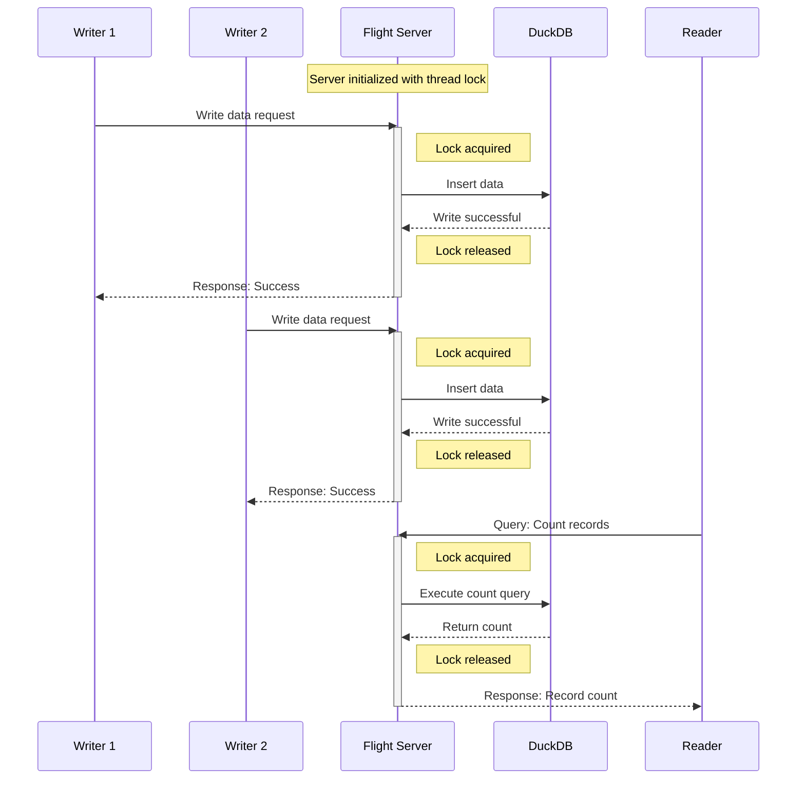

## Overview

In this example, we'll create:
- A DuckDB-backed Flight server
- Two writer clients that continuously add data
- One reader client that continuously queries the data (counts)

This pattern is useful for scenarios where you need to support multiple
concurrent operations on your database while maintaining performance and data
integrity.

## TTYREC

Watch this vignette in action:

<a href="https://asciinema.org/a/709879" target="_blank">
  
</a>

## Try It Yourself

The complete source code for this example is available in the xorq GitHub
repository:
[duckdb_flight_example.py](https://github.com/xorq-labs/xorq/blob/main/examples/duckdb_flight_example.py)
You can run this example directly using nix:

```bash
nix run github:xorq-labs # TODO
````
## How It Works


- **Server**: The example initializes a DuckDB database and sets up a Flight
  server. It creates a table with a simple schema (id and value) and then waits
  for client connections.

- **Writers**: The writer function connects to the Flight server and
  continuously uploads new data records with a timestamp ID and a random value.

- **Reader**: The reader function connects to the Flight server and
  continuously queries the count of records in the table.

The example demonstrates how xorq handles the concurrent operations smoothly, allowing multiple clients to interact with the database simultaneously.

## Key Concepts

- **Flight Server**: xorq's implementation of Apache Arrow Flight for
  high-performance data transfer. As such, xorq makes it easier to spin up
  Flight servers without diving into Flight RPC details.

- **Concurrency Control with Locks**: The example demonstrates xorq's
  implementation of threading locks to safely manage concurrent database
  operations. While DuckDB itself supports concurrent reads and writes within a
  single process using optimistic concurrency control (as described in the
  [DuckDB documentation on
  concurrency](https://duckdb.org/docs/stable/connect/concurrency.html)), xorq
  adds an additional layer of protection through explicit locks. This ensures
  that operations from multiple clients are properly serialized when accessing
  the Flight server, preventing race conditions and maintaining data integrity
  even under high concurrency scenarios.

## Next Steps
Try modifying this example to:

- Increase the number of readers or writers
- Use different data types or more complex schemas
- Implement error handling and recovery strategies
- Try with a different dataset and more complex query than a count
